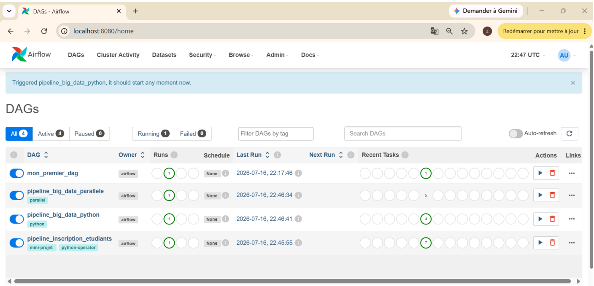
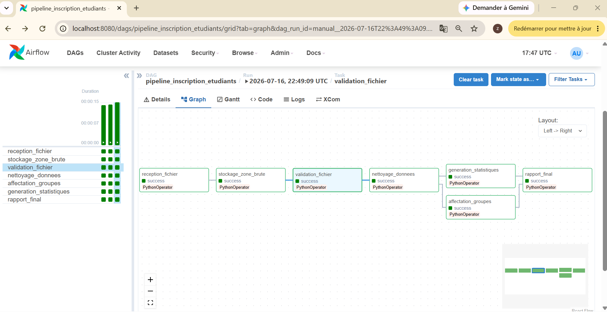
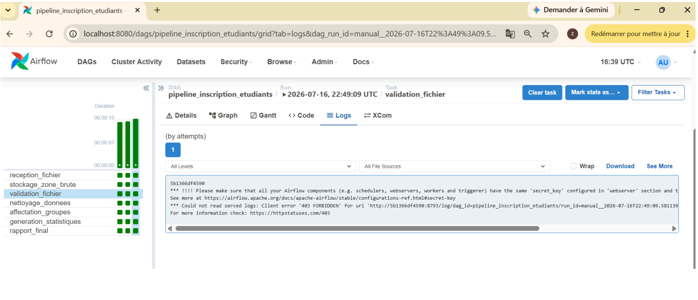

# TP6 - Atelier Big Data Apache Airflow

## Livrables

### 1. Fichier `mon_premier_dag.py`
Dans le dossier `dags`.

### 2. Fichier `pipeline_big_data_python.py`
Dans le dossier `dags`.

### 3. Fichier `pipeline_big_data_parallele.py`
Dans le dossier `dags`.

### 4. Fichier `pipeline_inscription_etudiants.py`
Dans le dossier `dags`.

### 5. Capture de la liste des DAGs

### 6. Capture de la vue Graph

### 7. Capture des logs d'une tâche PythonOperator

